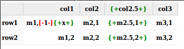

[](https://travis-ci.org/smootoo/TableDiff)
[](https://coveralls.io/r/smootoo/TableDiff?branch=master)

TableDiff
=========

A Scala based (but usable from Java and other JDK languages) utility for finding a diff of 2 tables, taking account of their structure. 

Available on [maven central](http://search.maven.org/#artifactdetails|org.suecarter|tablediff_2.11|1.0.1|jar)
 
For usage example in java. (See this in the class [org.suecarter.javatablediffexample.JavaTableDiffTest.java](./SampleApp/src/test/java/org/suecarter/javatablediffexample/JavaTableDiffTest.java), the testDemo test)

```
Compare left table
+----+--------------+
|    |col1|col2|col3|
+----+--------------+
|row1|m1,1|m2,1|m3,1|
|row2|m1,2|m2,2|m3,2|
+----+--------------+

to right table
+----+---------------------+
|    |col1|col2|col2.5|col3|
+----+---------------------+
|row1|m1,x|m2,1|m2.5,1|m3,1|
|row2|m1,2|m2,2|m2.5,2|m3,2|
+----+---------------------+

Produces these diffs, showing us that the cell in row1,col1 has
changed from m1,1 to m1,x and a whole new column (col2.5) has 
been added.
+----+----------------------------------+
|    |col1         |col2|{+col2.5+}|col3|
+----+----------------------------------+
|row1|m1,[-1-]{+x+}|m2,1|{+m2.5,1+}|m3,1|
|row2|m1,2         |m2,2|{+m2.5,2+}|m3,2|
+----+----------------------------------+
```


You can render the result in HTML and have something looking like



This can be useful in Jenkins, using the HTML publisher plugin to put test results in an easy to read format.


----

The html rendering code is a hacked around version of https://github.com/mmurph211/Grid
MIT-style license. Copyright 2012 Matt V. Murphy
